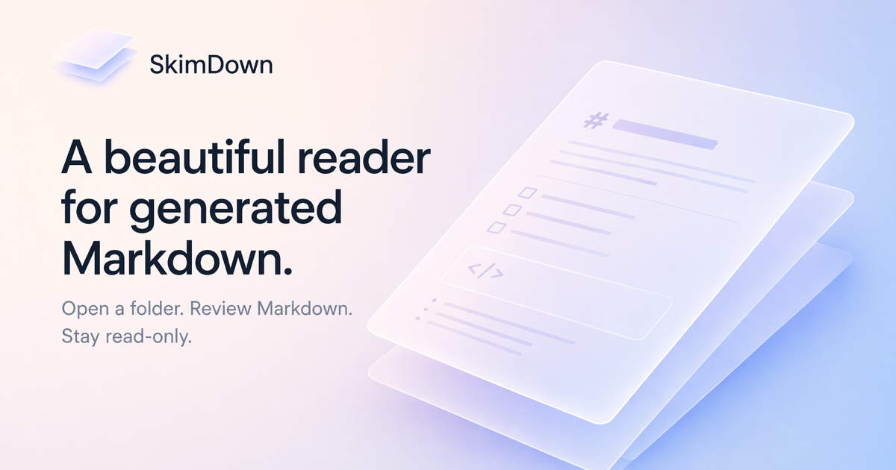

<p align="center">
  
</p>

<p align="center">
  <a href="https://github.com/07JP27/SkimDown/actions/workflows/ci.yml"></a>
  <a href="https://github.com/07JP27/SkimDown/releases/latest"></a>
  <a href="LICENSE"></a>
  
  
  <a href="https://github.com/sponsors/07JP27"></a>
</p>

<p align="center">English | <a href="README_ja.md">日本語</a></p>

---

SkimDown is a native macOS reader for Markdown folders generated by AI agents, developer tools, and teams.
Open a folder, and SkimDown shows only the Markdown files in a sidebar tree and renders the selected file in a calm, read-only preview — no editor chrome, no accidental edits.

> **📖 Looking for installation, usage, or keyboard shortcuts?**
> See the user-facing docs in [`docs/`](docs/index.md) ([日本語](docs/ja/index.md)).

## Highlights

- 📂 Open a folder with **File → Open Folder…**, **⌘O**, or by dragging a folder onto the window
- 🪟 Multiple windows for multiple folders
- 🌲 Folder-first, case-insensitive Markdown tree (recursive `.md` / `.markdown` discovery)
- 🙈 Hidden-file and ignored-directory filtering
- 📖 Read-only `WKWebView` preview with bundled rendering assets (no CDN required)
- 🔍 In-document search for the current file
- ♻️ Live reload — Markdown add / delete / rename / update events refresh the tree and preview
- 💾 Persists sidebar position, visibility, width, theme, font size, recent folders, last selected file, and tree expansion state
- 🔒 Sandboxed, local-only — no telemetry, no Markdown text leaves your machine

## Architecture

Pure **Swift 6 + AppKit** with `WKWebView` for Markdown rendering. macOS 26+. No external dependencies. The Xcode project is generated by [xcodegen](https://github.com/yonaskolb/XcodeGen) from `src/project.yml`.

| Layer | Directory | Purpose |
|---|---|---|
| **App** | `src/SkimDown/App/` | Application startup, menus, window management |
| **Core** | `src/SkimDown/Core/` | Folder access, security-scoped bookmarks, settings, file-system watching |
| **Sidebar** | `src/SkimDown/Sidebar/` | Markdown tree, selection, expansion state |
| **Markdown** | `src/SkimDown/Markdown/` | Discovery, link resolution, HTML helpers |
| **Viewer** | `src/SkimDown/Viewer/` | `WKWebView` integration, in-document search, link routing |
| **Models** | `src/SkimDown/Models/` | Folder session, tree items, settings models |
| **Utilities** | `src/SkimDown/Utilities/` | URL/path helpers, folder-boundary checks, extensions |
| **Resources** | `src/SkimDown/Resources/` | Bundled CSS, JS, templates, icons |

Detailed design documents are in [`design/`](design/).

## Development

### Prerequisites

- macOS 26+
- Xcode 26+ (with Swift 6 toolchain)
- [xcodegen](https://github.com/yonaskolb/XcodeGen) (`brew install xcodegen`) — needed when editing `src/project.yml`
- Node.js and npm — only for the VitePress documentation site

### Build commands

```bash
make build              # Debug build
make test               # Run unit tests
make run                # Build and launch the app
make launch-check       # GUI smoke test (build + launch + verify on-screen window)
make release            # Release build
make notarize           # Release build + Apple notarization
make dmg VERSION=1.0.0  # Release build + DMG packaging
make clean              # Clean build artifacts
make generate           # Regenerate .xcodeproj (after editing src/project.yml)
make docs               # Start local documentation dev server
make docs-build         # Build documentation site
```

### Code signing and notarization

macOS Gatekeeper blocks unsigned apps downloaded from the internet. To distribute SkimDown without requiring users to bypass Gatekeeper warnings, the app must be signed with a Developer ID certificate and notarized by Apple.

> **Note:** The DMGs published from this repository's CI are currently **ad-hoc signed**, so users have to clear the quarantine flag with `xattr -cr /Applications/SkimDown.app`. The flow below is for maintainers who want to produce a Developer ID-signed and notarized build locally.

Copy `.env.example` to `.env` and fill in your credentials:

```bash
cp .env.example .env
```

| Variable | Description |
| --- | --- |
| `APPLE_ID` | Your Apple ID email address |
| `APPLE_TEAM_ID` | Your Apple Developer Team ID |
| `APPLE_APP_PASSWORD` | An [app-specific password](https://support.apple.com/en-us/102654) generated at appleid.apple.com |
| `DEVELOPER_NAME` | Your name as it appears on your Developer ID certificate |

Then run:

```bash
make dmg VERSION=1.0.0
```

This builds a Release binary, packages it into a DMG, and (with `make notarize`) submits it to Apple for notarization and staples the notarization ticket.

> **Note:** Notarization requires an [Apple Developer Program](https://developer.apple.com/programs/) membership. The `.env` file is gitignored and must never be committed.

## License

This project is licensed under the [GNU General Public License v3.0](LICENSE).
