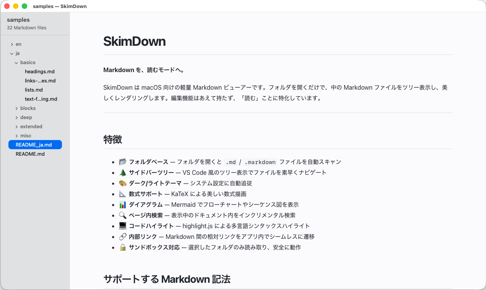

<p align="center">
  
</p>

<p align="center">
  <a href="https://github.com/07JP27/SkimDown/actions/workflows/ci.yml"></a>
  <a href="https://github.com/07JP27/SkimDown/releases/latest"></a>
  <a href="LICENSE"></a>
  
  
  <a href="https://github.com/sponsors/07JP27"></a>
</p>

<p align="center"><a href="README.md">English</a> | 日本語</p>

---

SkimDown は、AI エージェントや開発ツール、チームが生み出す Markdown 群を読むためのネイティブ macOS リーダーです。
フォルダを開くと、Markdown だけがサイドバーツリーに並び、選択したファイルを静かな読み取り専用プレビューで表示します。エディタの UI も、誤編集の不安もありません。

> **📖 インストール・使い方・キーボードショートカットをお探しですか？**
> ユーザー向けドキュメントは [`docs/ja/`](docs/ja/index.md)（[English](docs/index.md)）を参照してください。

## ハイライト

- 📂 **File → Open Folder…**、**⌘O**、ウィンドウへのフォルダドラッグ&ドロップでフォルダを開く
- 🪟 複数フォルダを複数ウィンドウで表示
- 🌲 フォルダ優先・大文字小文字を区別しない Markdown ツリー（`.md` / `.markdown` を再帰的に検出）
- 🙈 隠しファイルと除外ディレクトリのフィルタリング
- 📖 同梱レンダリングアセットによる読み取り専用 `WKWebView` プレビュー（CDN 不要）
- 🔍 表示中ファイル内検索
- ♻️ ライブリロード — Markdown の追加・削除・リネーム・更新を検知してツリーとプレビューを更新
- 💾 サイドバー位置・表示状態・幅・テーマ・フォントサイズ・最近開いたフォルダ・最後に開いたファイル・ツリー開閉状態を保存
- 🔒 Sandbox 有効・ローカル動作 — テレメトリなし、Markdown 本文を外部送信しない

## アーキテクチャ

純粋な **Swift 6 + AppKit** に Markdown レンダリング用 `WKWebView` を組み合わせた構成です。macOS 26+。外部依存なし。Xcode プロジェクトは [xcodegen](https://github.com/yonaskolb/XcodeGen) により `src/project.yml` から生成します。

| レイヤー | ディレクトリ | 役割 |
|---|---|---|
| **App** | `src/SkimDown/App/` | アプリ起動、メニュー、ウィンドウ管理 |
| **Core** | `src/SkimDown/Core/` | フォルダ権限、security-scoped bookmark、設定保存、ファイル監視 |
| **Sidebar** | `src/SkimDown/Sidebar/` | Markdown ツリー、選択、開閉状態 |
| **Markdown** | `src/SkimDown/Markdown/` | ファイル走査、リンク解決、HTML 補助 |
| **Viewer** | `src/SkimDown/Viewer/` | `WKWebView` 連携、表示中ファイル内検索、リンク処理 |
| **Models** | `src/SkimDown/Models/` | フォルダセッション、ツリー項目、設定モデル |
| **Utilities** | `src/SkimDown/Utilities/` | URL / パスヘルパー、フォルダ境界チェック、拡張 |
| **Resources** | `src/SkimDown/Resources/` | 同梱 CSS、JS、テンプレート、アイコン |

詳細な設計ドキュメントは [`design/`](design/) にあります。

## 開発

### 前提条件

- macOS 26+
- Xcode 26+（Swift 6 ツールチェーン）
- [xcodegen](https://github.com/yonaskolb/XcodeGen)（`brew install xcodegen`）— `src/project.yml` を編集する場合に必要
- Node.js と npm — VitePress ドキュメントサイト用

### ビルドコマンド

```bash
make build              # デバッグビルド
make test               # ユニットテスト実行
make run                # ビルドしてアプリを起動
make launch-check       # GUI スモークテスト（ビルド・起動・ウィンドウ確認）
make release            # リリースビルド
make notarize           # リリースビルド + Apple 公証
make dmg VERSION=1.0.0  # リリースビルド + DMG パッケージング
make clean              # ビルド成果物をクリーンアップ
make generate           # .xcodeproj を再生成（src/project.yml 編集後）
make docs               # ドキュメントサイトのローカル開発サーバー起動
make docs-build         # ドキュメントサイトをビルド
```

### コード署名と公証

macOS の Gatekeeper は、インターネットからダウンロードされた未署名アプリをブロックします。Gatekeeper の警告を回避して SkimDown を配布するには、Developer ID 証明書で署名し、Apple の公証を受ける必要があります。

> **メモ:** 本リポジトリの CI から公開されている DMG は現状 **ad-hoc 署名**のため、利用者側で `xattr -cr /Applications/SkimDown.app` による検疫フラグ解除が必要です。以下のフローは、メンテナがローカルで Developer ID 署名 + 公証付きビルドを作成するための手順です。

`.env.example` を `.env` にコピーして認証情報を入力します：

```bash
cp .env.example .env
```

| 変数 | 説明 |
| --- | --- |
| `APPLE_ID` | Apple ID のメールアドレス |
| `APPLE_TEAM_ID` | Apple Developer Team ID |
| `APPLE_APP_PASSWORD` | appleid.apple.com で生成した[アプリ用パスワード](https://support.apple.com/ja-jp/102654) |
| `DEVELOPER_NAME` | Developer ID 証明書に記載されている名前 |

そして次のコマンドを実行します：

```bash
make dmg VERSION=1.0.0
```

リリースバイナリをビルドして DMG にパッケージし、`make notarize` を併用すると Apple に公証申請して公証チケットをステープルします。

> **注意:** 公証には [Apple Developer Program](https://developer.apple.com/programs/) のメンバーシップが必要です。`.env` ファイルは gitignore に含まれており、コミットしないでください。

## ライセンス

本プロジェクトは [GNU General Public License v3.0](LICENSE) の下で公開されています。
