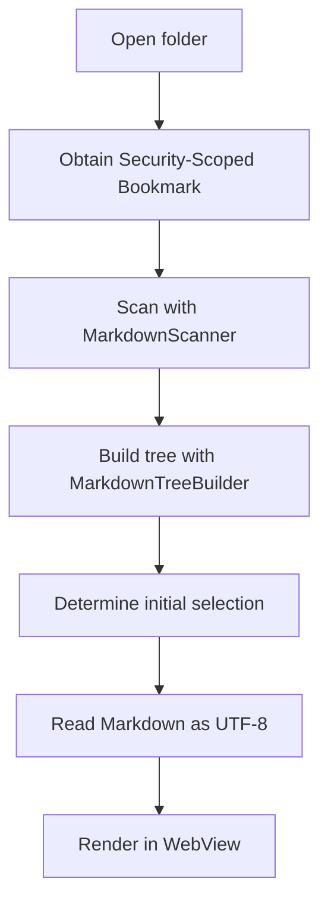
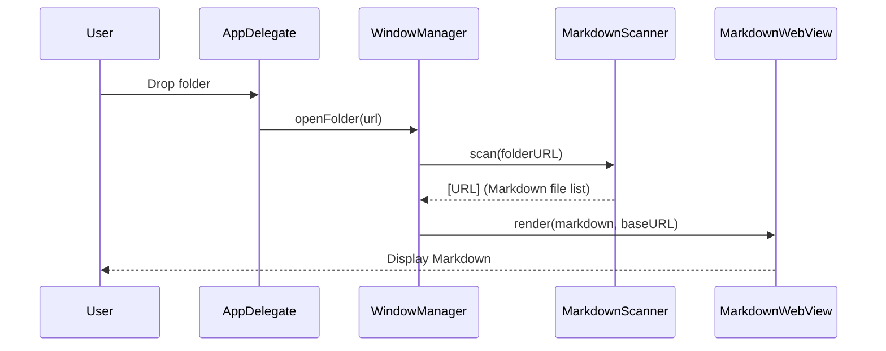
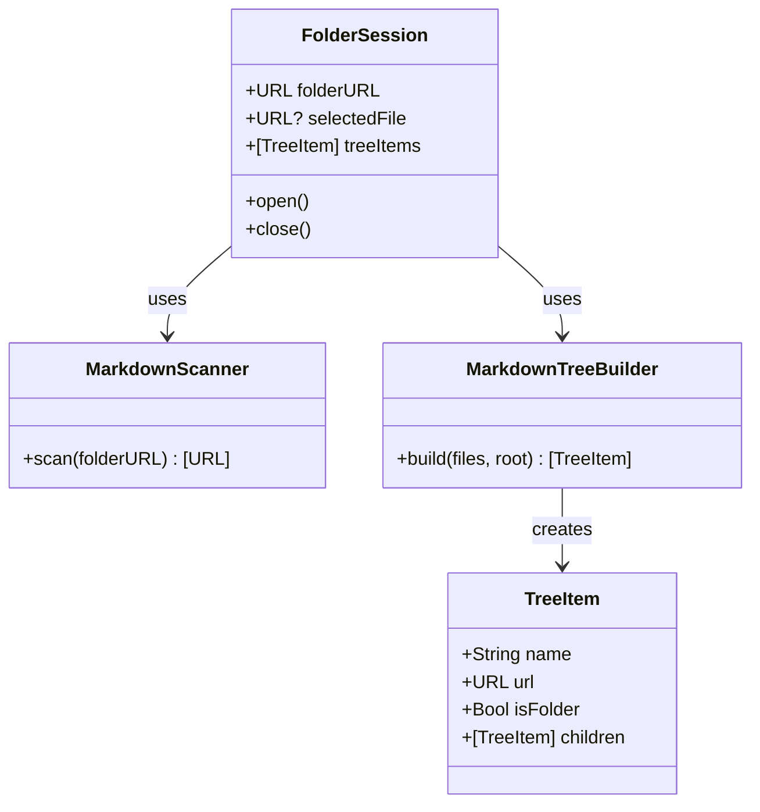
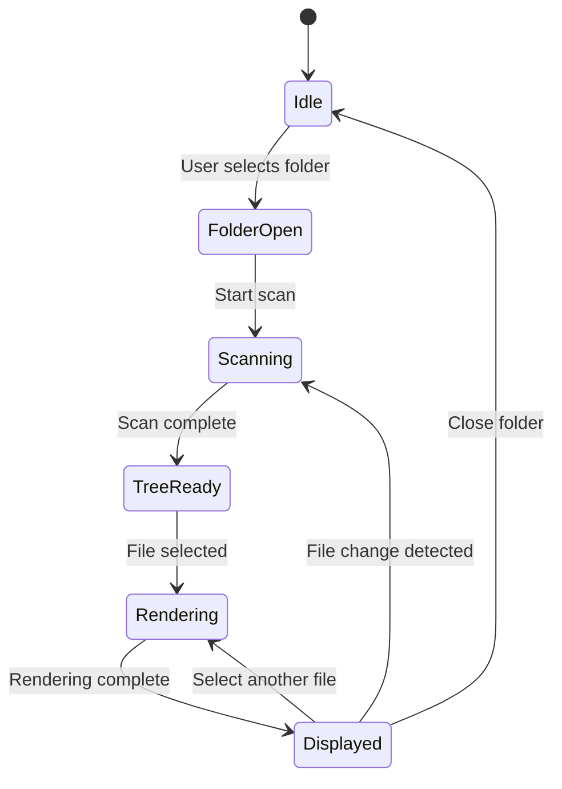
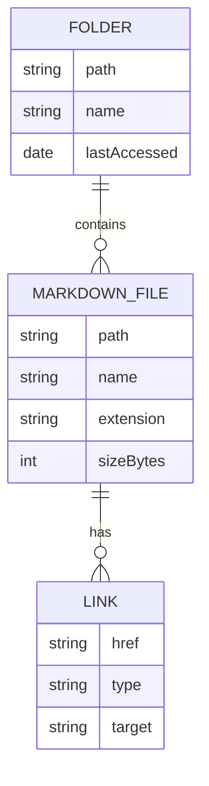
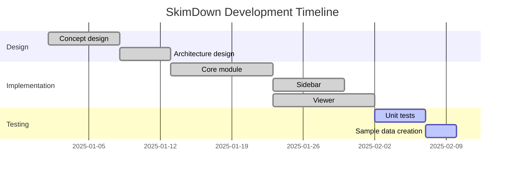
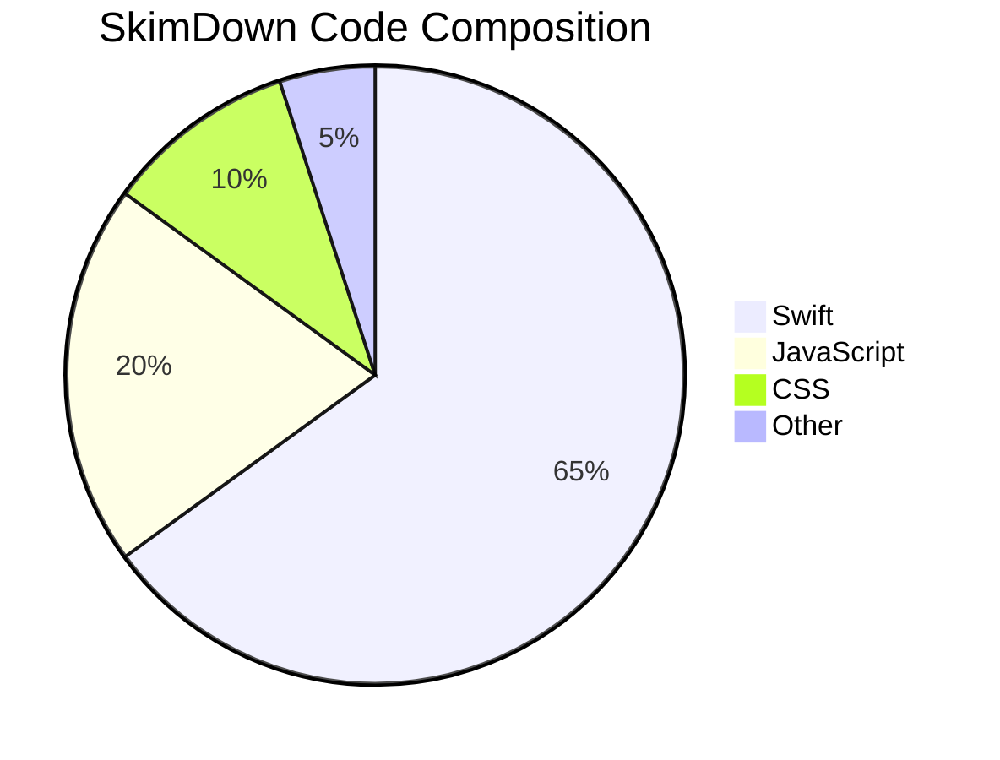

# Diagrams (Mermaid)

SkimDown uses Mermaid to render diagrams from code.

## Flowchart

```mermaid
flowchart TD
    A[Open folder] --> B[Obtain Security-Scoped Bookmark]
    B --> C[Scan with MarkdownScanner]
    C --> D[Build tree with MarkdownTreeBuilder]
    D --> E[Determine initial selection]
    E --> F[Read Markdown as UTF-8]
    F --> G[Render in WebView]
```

## Sequence Diagram

```mermaid
sequenceDiagram
    participant U as User
    participant A as AppDelegate
    participant W as WindowManager
    participant S as MarkdownScanner
    participant V as MarkdownWebView

    U->>A: Drop folder
    A->>W: openFolder(url)
    W->>S: scan(folderURL)
    S-->>W: [URL] (Markdown file list)
    W->>V: render(markdown, baseURL)
    V-->>U: Display Markdown
```

## Class Diagram

```mermaid
classDiagram
    class FolderSession {
        +URL folderURL
        +URL? selectedFile
        +[TreeItem] treeItems
        +open()
        +close()
    }
    class MarkdownScanner {
        +scan(folderURL) [URL]
    }
    class MarkdownTreeBuilder {
        +build(files, root) [TreeItem]
    }
    class TreeItem {
        +String name
        +URL url
        +Bool isFolder
        +[TreeItem] children
    }

    FolderSession --> MarkdownScanner : uses
    FolderSession --> MarkdownTreeBuilder : uses
    MarkdownTreeBuilder --> TreeItem : creates
```

## State Diagram

```mermaid
stateDiagram-v2
    [*] --> Idle
    Idle --> FolderOpen : User selects folder
    FolderOpen --> Scanning : Start scan
    Scanning --> TreeReady : Scan complete
    TreeReady --> Rendering : File selected
    Rendering --> Displayed : Rendering complete
    Displayed --> Rendering : Select another file
    Displayed --> Scanning : File change detected
    Displayed --> Idle : Close folder
```

## ER Diagram

```mermaid
erDiagram
    FOLDER ||--o{ MARKDOWN_FILE : contains
    FOLDER {
        string path
        string name
        date lastAccessed
    }
    MARKDOWN_FILE {
        string path
        string name
        string extension
        int sizeBytes
    }
    MARKDOWN_FILE ||--o{ LINK : has
    LINK {
        string href
        string type
        string target
    }
```

## Gantt Chart

```mermaid
gantt
    title SkimDown Development Timeline
    dateFormat  YYYY-MM-DD
    section Design
    Concept design        :done, d1, 2025-01-01, 7d
    Architecture design   :done, d2, after d1, 5d
    section Implementation
    Core module           :done, i1, after d2, 10d
    Sidebar               :done, i2, after i1, 7d
    Viewer                :done, i3, after i1, 10d
    section Testing
    Unit tests            :active, t1, after i3, 5d
    Sample data creation  :active, t2, after t1, 3d
```

## Pie Chart

```mermaid
pie title SkimDown Code Composition
    "Swift" : 65
    "JavaScript" : 20
    "CSS" : 10
    "Other" : 5
```
