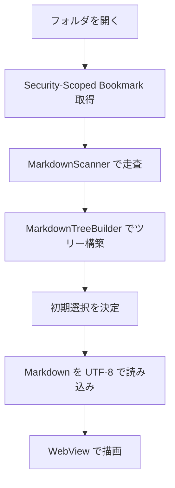
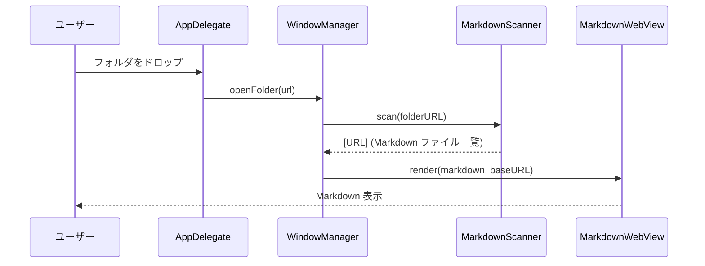
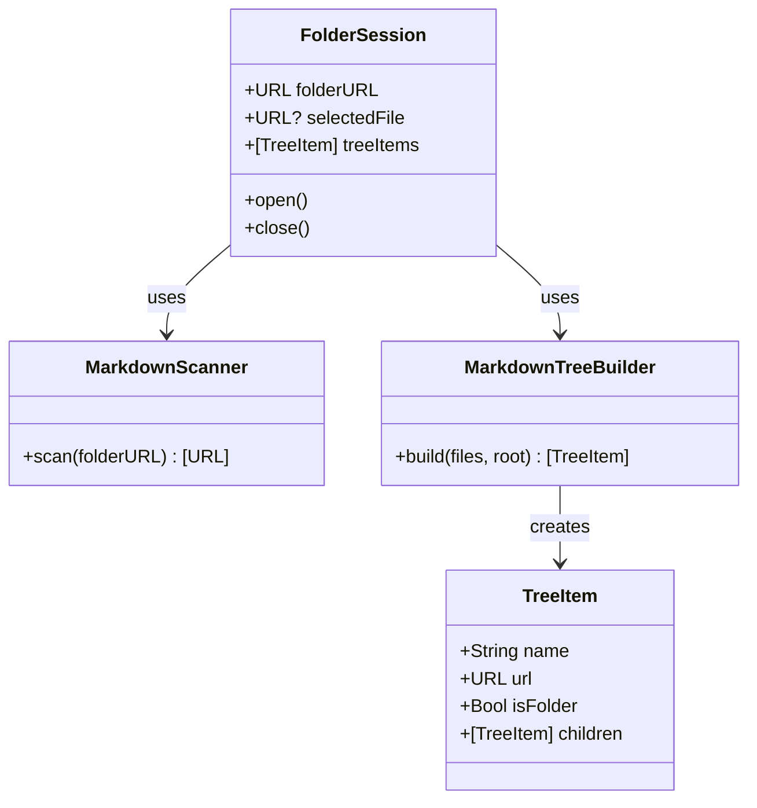
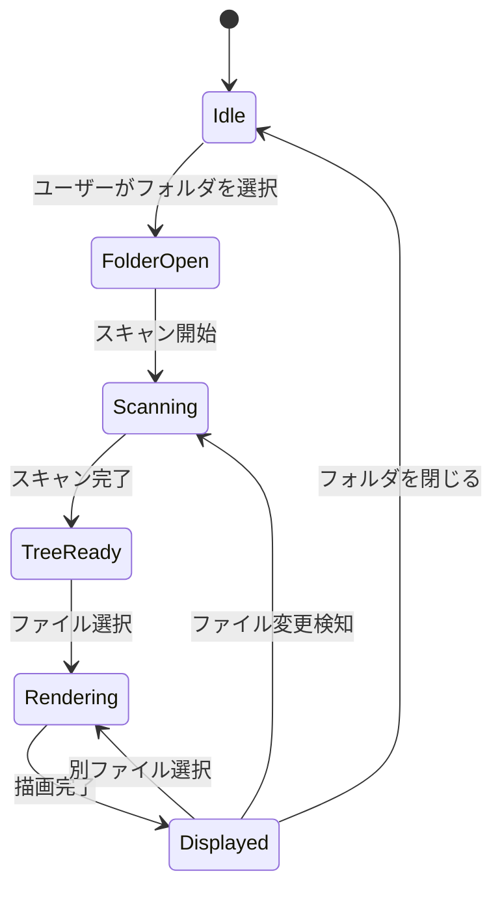
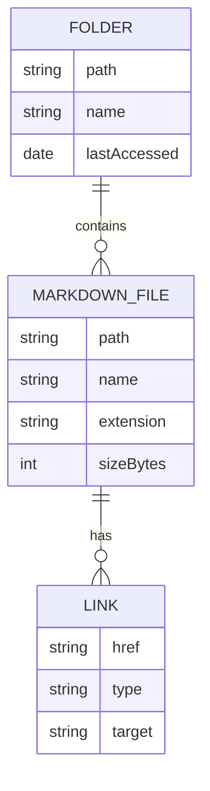
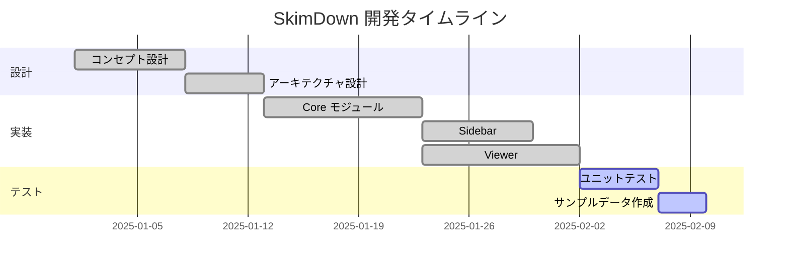
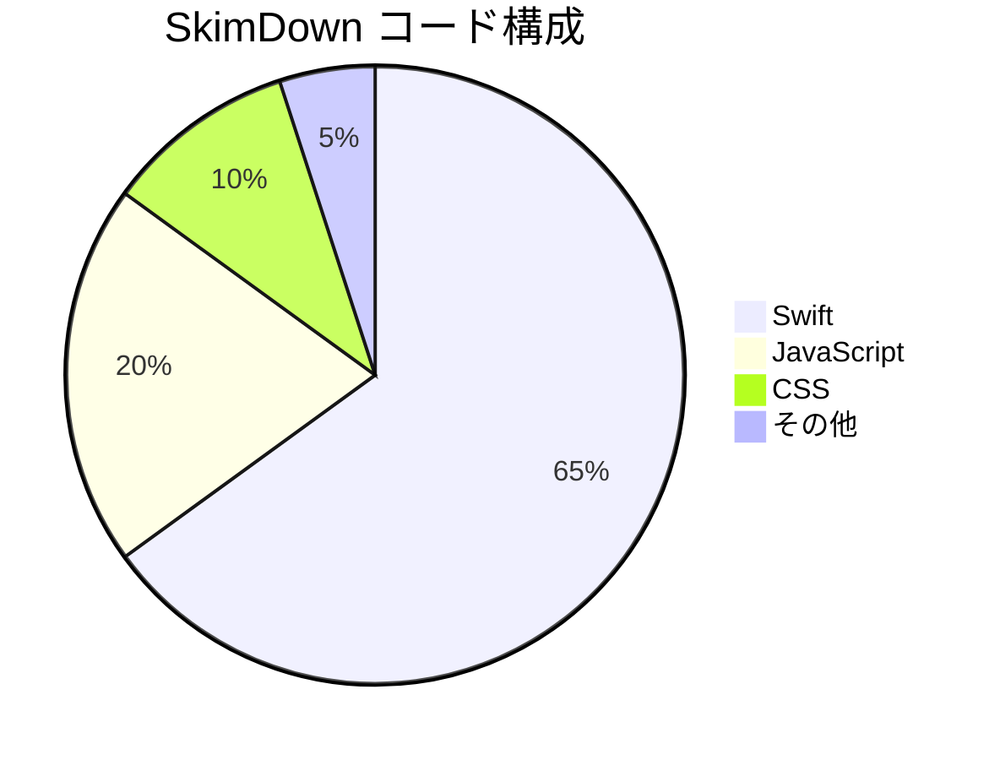

# ダイアグラム（Mermaid）

SkimDown は Mermaid を使ってコードからダイアグラムを描画します。

## フローチャート

```mermaid
flowchart TD
    A[フォルダを開く] --> B[Security-Scoped Bookmark 取得]
    B --> C[MarkdownScanner で走査]
    C --> D[MarkdownTreeBuilder でツリー構築]
    D --> E[初期選択を決定]
    E --> F[Markdown を UTF-8 で読み込み]
    F --> G[WebView で描画]
```

## シーケンス図

```mermaid
sequenceDiagram
    participant U as ユーザー
    participant A as AppDelegate
    participant W as WindowManager
    participant S as MarkdownScanner
    participant V as MarkdownWebView

    U->>A: フォルダをドロップ
    A->>W: openFolder(url)
    W->>S: scan(folderURL)
    S-->>W: [URL] (Markdown ファイル一覧)
    W->>V: render(markdown, baseURL)
    V-->>U: Markdown 表示
```

## クラス図

```mermaid
classDiagram
    class FolderSession {
        +URL folderURL
        +URL? selectedFile
        +[TreeItem] treeItems
        +open()
        +close()
    }
    class MarkdownScanner {
        +scan(folderURL) [URL]
    }
    class MarkdownTreeBuilder {
        +build(files, root) [TreeItem]
    }
    class TreeItem {
        +String name
        +URL url
        +Bool isFolder
        +[TreeItem] children
    }

    FolderSession --> MarkdownScanner : uses
    FolderSession --> MarkdownTreeBuilder : uses
    MarkdownTreeBuilder --> TreeItem : creates
```

## 状態図

```mermaid
stateDiagram-v2
    [*] --> Idle
    Idle --> FolderOpen : ユーザーがフォルダを選択
    FolderOpen --> Scanning : スキャン開始
    Scanning --> TreeReady : スキャン完了
    TreeReady --> Rendering : ファイル選択
    Rendering --> Displayed : 描画完了
    Displayed --> Rendering : 別ファイル選択
    Displayed --> Scanning : ファイル変更検知
    Displayed --> Idle : フォルダを閉じる
```

## ER 図

```mermaid
erDiagram
    FOLDER ||--o{ MARKDOWN_FILE : contains
    FOLDER {
        string path
        string name
        date lastAccessed
    }
    MARKDOWN_FILE {
        string path
        string name
        string extension
        int sizeBytes
    }
    MARKDOWN_FILE ||--o{ LINK : has
    LINK {
        string href
        string type
        string target
    }
```

## ガントチャート

```mermaid
gantt
    title SkimDown 開発タイムライン
    dateFormat  YYYY-MM-DD
    section 設計
    コンセプト設計     :done, d1, 2025-01-01, 7d
    アーキテクチャ設計  :done, d2, after d1, 5d
    section 実装
    Core モジュール     :done, i1, after d2, 10d
    Sidebar             :done, i2, after i1, 7d
    Viewer              :done, i3, after i1, 10d
    section テスト
    ユニットテスト      :active, t1, after i3, 5d
    サンプルデータ作成   :active, t2, after t1, 3d
```

## 円グラフ

```mermaid
pie title SkimDown コード構成
    "Swift" : 65
    "JavaScript" : 20
    "CSS" : 10
    "その他" : 5
```
